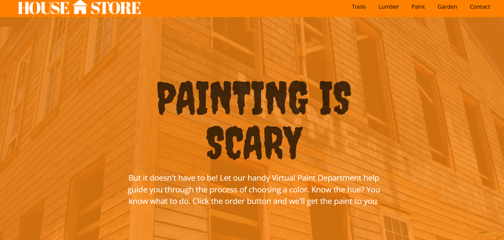
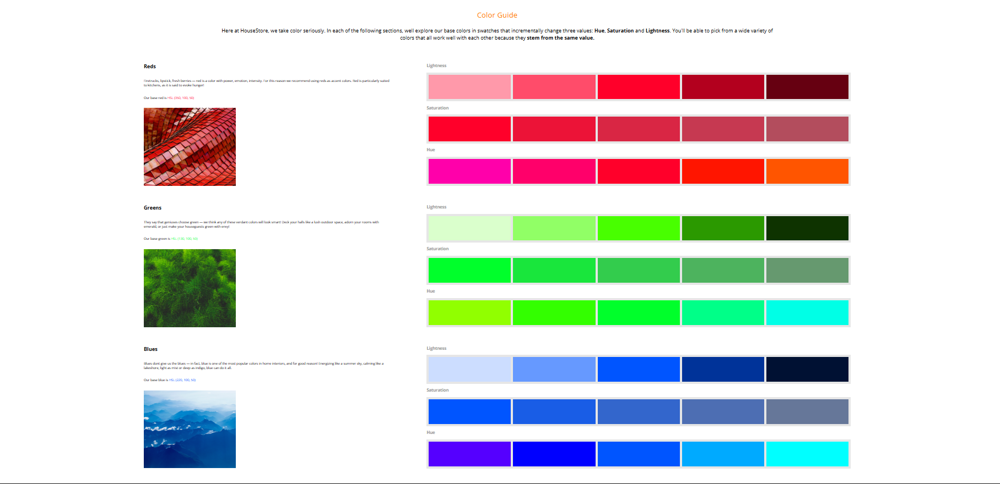

# Paint Store

Welcome to **Paint Store**, a virtual paint department web project completed as part of Codecademy's curriculum. This project demonstrates a modern, responsive web page for a fictional paint and home improvement store, featuring interactive color guides and a clean, professional design.

## Features

- Responsive layout for desktop and mobile
- Interactive color guide with HSL swatches for Reds, Greens, and Blues
- Themed sections for each color family with explanations and visual swatches
- Modern, accessible design using custom fonts and CSS
- Easy-to-navigate header and footer

## Screenshots

<!-- Add screenshots of your project here -->

## How to Use

1. Clone or download this repository.
2. Open `index.html` in your web browser.
3. Explore the color guides and use the navigation to browse different sections.

## Technologies Used

- HTML5
- CSS3 (including Flexbox and media queries)
- Google Fonts

## Credits

- Project completed through [Codecademy](https://www.codecademy.com/)
- Images and starter assets provided by Codecademy

## License

This project is licensed under the MIT License. See the [LICENSE](LICENSE) file for details.
